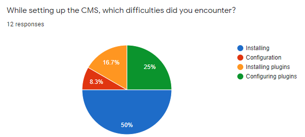
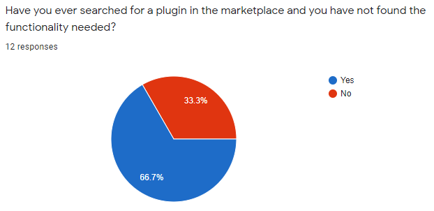

## Milestone 2

### The problem
We identified a need for some essential plugins and extensions, which are part of the Content Management System (CMS).

### Our solution
The solution proposed is to develop key plugins for CMS like like Joomla, Magento, OpenCart, PrestaShop, Shopify, WooCommerce.

### Plan for customer discovery
We decided we would collect information using:
- online forms
- face to face discussions

### The process
To discover our target market and the needs of our customers, we decided the best places to collect information are:
- Universities with web development subjects
- Offices for IT companies

For collecting as much information as possible without boring the subjects, we settled on a few questions:
- Job role
- For software developers, asking them whether they develop websites themselves or outsource the task
- CMS used
- Difficulties encountered while setting up the CMS
- Availability of plugins for the functionality they need

### What did we learn from it?
We got the following responses to our questions:
- 
- 
- 
- 
- 
- 

### Moving on
As our study suggested, there is interest in finding an easy way to install and configure CMS plug-ins, especially WordPress, which makes us to think that our Plugineer platform can solve some of the problems of the ones that use CMS sites.
